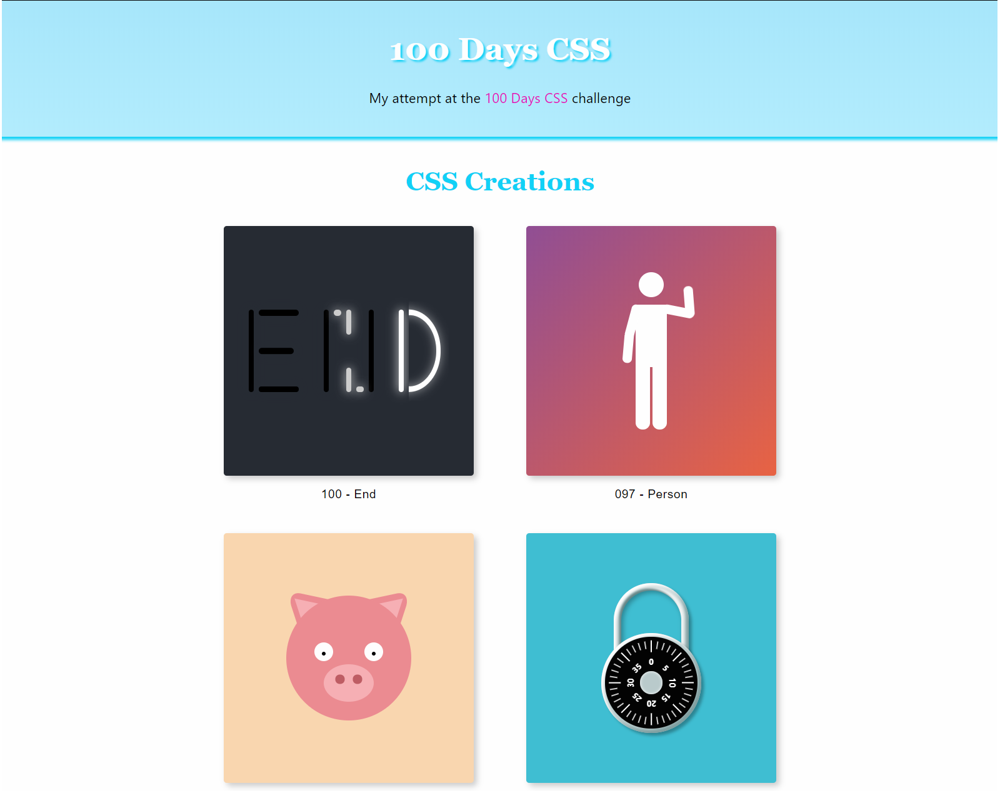

# 100 Days CSS (work in progress)

[View project](https://sargalias-100-days-css.netlify.com)

My attempt at recreating some of the [100 Days CSS](https://100dayscss.com) frames, with additional features.



## Table of contents

- [Features](#features)
- [Getting started](#getting-started)
  - [Prerequisites](#prerequisites)
  - [Installation](#installation)
- [Usage](#usage)
  - [Starting the project](#starting-the-project)
  - [Building the project](#building-the-project)
  - [Code formatting](#code-formatting)
- [Built with](#built-with)
- [License](#license)

## Features

- **Responsiveness**: These have been made almost 100% responsive, meaning that if you resize the frame width and height, it will be as though you zoomed in / out. The notable exceptions are the frames which contain text, as text can't be sized relative to its container with CSS.

- **Easy changes to each frame**: Every frame has several variables which can be changed to affect how the image looks. Some math was used to make this work.

- **Animations pause if the frame is not visible on the screen**: This is because slower devices such as mobile were experiencing significant slowdown as more frames were added.

- **Page is pre-rendered.**

- **Lazy loading of CSS frames further down the page.**

## Getting started

These instructions will get you a copy of the project up and running on your local machine for development and testing purposes.

### Prerequisites

- NPM

Installation requires [NPM](https://www.npmjs.com/) which is included with [Node](https://nodejs.org/). You can install Node by downloading the installer from the website.

To update NPM to the latest version:

```
npm install -g npm@latest
```

### Installation

1. Clone the repo

```
git clone https://github.com/sargalias/100-days-css.git
```

2. Install NPM packages

```
npm install
```

### Running the project for development

```
npm start
```

## Usage

### Starting the project

- Start the project for development: `npm start`
- Serve the production build of your site: `npm run serve`

### Building the project

- Build the project for production: `npm run build`

### Code formatting

- Format code with [Prettier](https://prettier.io) code formatter: `npm run format`

## Built with

- [Gatsby](https://www.gatsbyjs.org/) - Static site generator based on React.
- [React](https://reactjs.org/) - The JavaScript framework used.
- [Prettier](https://prettier.io/) - Code formatting
- [react-intersection-visible](https://github.com/AvraamMavridis/react-intersection-visible) - Package for easy notification of when a component is visible on-screen.
- [react-lazyload](https://github.com/twobin/react-lazyload) - Package for lazy-loading React components.
- [react-helmet](https://github.com/nfl/react-helmet) - Document head manager for React.
- And some others, including Gatsby plugins.

## License

This project is licensed under the MIT License - see the [LICENSE.md](LICENSE.md) file for details.
